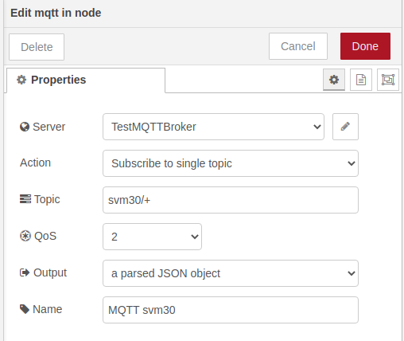
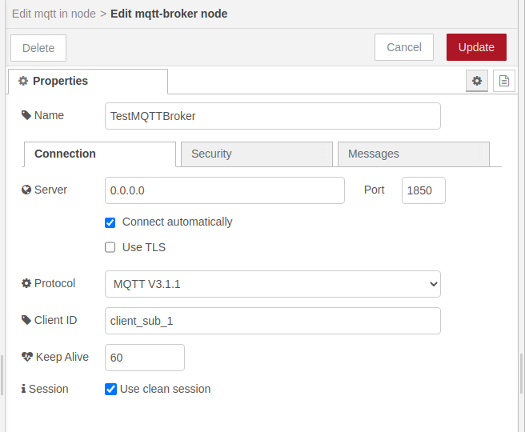

# Getting started

1. Install Node-RED and necessary ui models

```
npm install node-red

# now install the modules
node-red-stop
cd ~/.node-red
npm i node-red-node-daemon
npm i node-red-dashboard
cd
node-red-start
```
2. Go to http://127.0.0.1:1880/ and import the flow from flows.json

3. Configure the MQTT nodes to match your MQTT sever address and credentials (if needed)




4. Deploy imnported flow

5. Now you should see the UI at http://localhost:1880/ui
